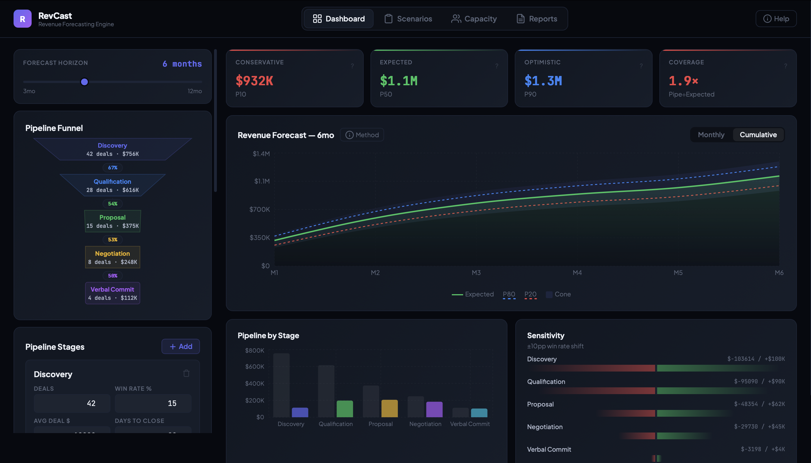

# RevCast — Revenue Forecasting Engine

A Monte Carlo revenue forecasting tool built for RevOps teams. It simulates your pipeline deal-by-deal to produce probabilistic forecasts with confidence intervals — replacing the static weighted pipeline calculations that most teams use.

**[Live Demo →](https://antmend.github.io/revcast)**



---

## Why this exists

Every RevOps team I've seen does forecasting the same way: multiply each deal's value by its stage probability, sum everything, call it "weighted pipeline." The problem is that this gives you exactly one number with zero information about how wrong it might be.

A sales VP asking "what's our forecast for Q3?" deserves more than a single number. They need:
- **How confident are we?** What's the range of likely outcomes?
- **Where is the risk?** Which stages have the most leverage on the forecast?
- **When does the revenue land?** Not all pipeline closes in the same month.
- **Do we have enough capacity?** Can our current team actually cover this forecast?

RevCast answers all four questions using simulation instead of arithmetic.

## How the model works

### The simulation

For each of 2,000 iterations:

1. **Every deal is simulated independently.** Each deal either closes or doesn't, based on its stage's win rate.
2. **Win rates are noisy.** Each stage's win rate is perturbed with Gaussian noise (σ=18%) per iteration. This models the reality that your team might overperform or underperform their historical averages.
3. **Deal values vary.** Each won deal's value fluctuates ±15% around the stage average, reflecting real negotiation outcomes.
4. **Close timing is log-normal.** Deals don't close on a neat schedule. The timing distribution is right-skewed — delays happen more often than acceleration. This is why the forecast curve isn't a straight line.

After 2,000 iterations, we take percentiles of the **cumulative** revenue (not monthly percentiles summed — that's a different and worse calculation that produces artificial linearity).

### Why percentiles, not averages

- **P10 (Conservative):** 90% of simulations beat this number. Your planning floor.
- **P50 (Expected):** The median outcome. Your most likely number.
- **P90 (Optimistic):** Only 10% of simulations reach this. Your stretch target.

The spread between P10 and P90 is your uncertainty cone. If it's wide, your forecast has high variance. If it's narrow, you can plan with more confidence.

### Key design decisions

| Decision | Rationale |
|---|---|
| Log-normal timing instead of Gaussian | Gaussian allows negative close times. Log-normal is right-skewed (delays > accelerations) which matches real sales cycles. |
| Per-iteration cumulative percentiles | Summing monthly P50s gives a straight line because variance cancels out. Computing cumulative per iteration, then taking percentiles, preserves the natural revenue accumulation curve. |
| Independent deals | Simplification. In production, you'd add correlation factors (e.g., if the economy slows, all deals get harder). This is a V1. |
| 18% win rate noise | Calibrated to produce ±25-35% confidence ranges, which matches what most SaaS companies see in forecast accuracy studies. |

## Features

### Dashboard
Pipeline stage editor with visual funnel, configurable forecast horizon (3-12 months), forecast chart with uncertainty cone, pipeline breakdown by stage, and sensitivity analysis showing which stages have the most leverage on your forecast.

### Scenario Planning  
Save pipeline configurations as named scenarios. Three demos are pre-loaded (Current, Aggressive, Conservative). Compare up to 3 scenarios side by side with overlaid cumulative forecast curves.

### Capacity Planning
Model your hiring needs based on quota, attainment rates, ramp time, and cost per rep. Includes:
- Capacity coverage gauge
- Ramp timeline showing when new hires become productive
- Hiring cost impact per scenario
- Warning system for ramp time gaps

### Dual Reports
- **Executive:** Clean visual summary for board meetings. The expected number, three scenarios, cumulative projection with uncertainty cone, key metrics.
- **Technical:** Full data dump. Model parameters, distribution histogram, per-stage breakdown with % contribution, sensitivity table, monthly cumulative forecast at all percentile levels.

## Running locally

```bash
git clone https://github.com/AntMend/revcast.git
cd revcast
npm install
npm run dev
```

Opens at `http://localhost:5173`.

## Deploying to GitHub Pages

```bash
npm run build
```

The `dist/` folder contains the static build. Deploy with GitHub Pages, Netlify, or Vercel.

## What I'd add in V2

These are deliberate scope cuts, not oversights:

- **Historical accuracy tracking.** Compare past forecasts to actuals to calibrate the noise parameters. Right now σ=18% is a reasonable default, but it should be tuned per company.
- **Deal-level correlation.** If one deal in an industry slips, related deals probably slip too. A copula model would capture this.
- **CRM integration.** Pull live pipeline data from Salesforce/HubSpot instead of manual entry.
- **Seasonality.** Month-over-month booking patterns aren't uniform. A seasonal adjustment layer would improve the timing model.
- **Rep-level modeling.** Different reps have different win rates. Modeling at the rep level instead of the stage level would increase accuracy.

## Stack

React 18 · Recharts · Vite · Pure JavaScript (no backend, no external APIs)

All computation runs client-side. No data leaves the browser.

---

Built as a portfolio project to demonstrate applied financial modeling for RevOps.
